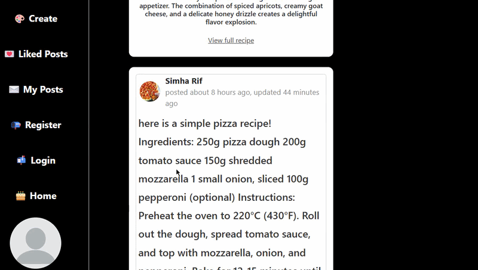
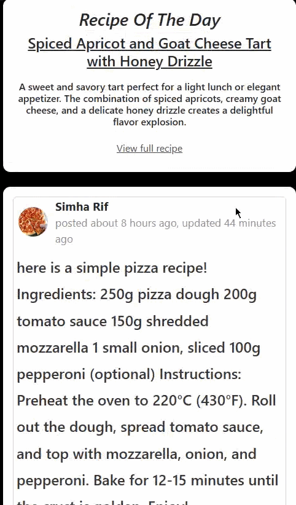
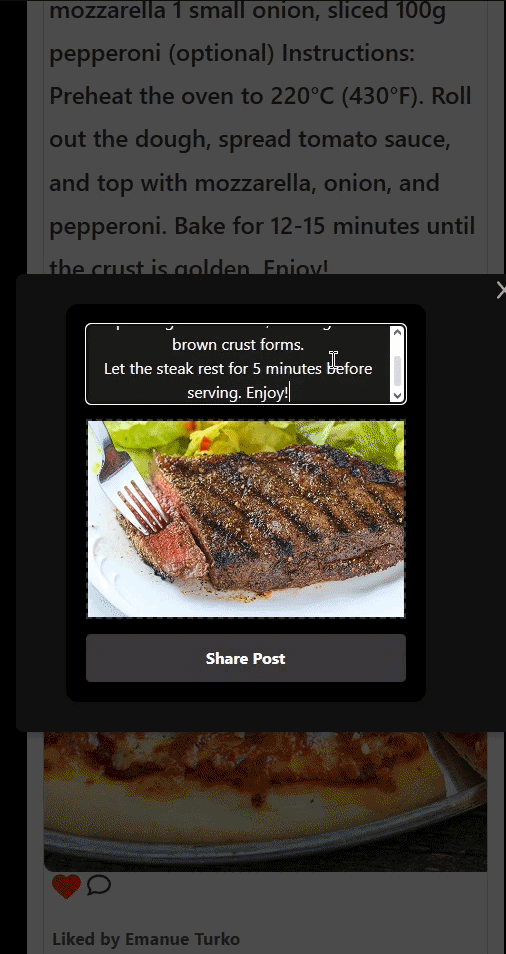
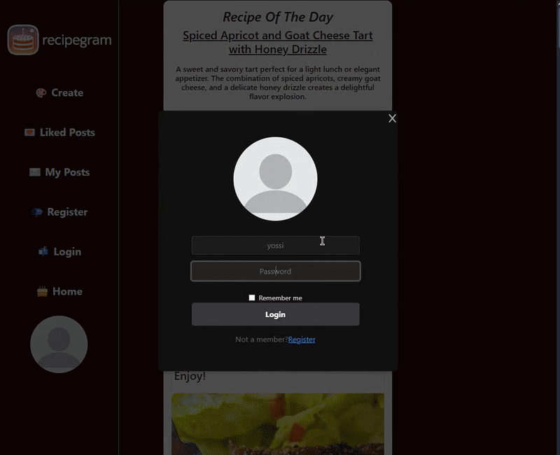

# Recipegram

A full-stack Instagram-style app for sharing recipes: users post, like, and comment on cooking content, sign in with Google, and get a daily AI-generated recipe suggestion.

Solo project.

### Sign up with Google

<p align="center">
  
</p>

### Recipe of the Day

AI-generated recipe suggestion shown on the home feed, powered by the Gemini API.

<p align="center">
  
</p>

### Creating a post

<p align="center">
  
</p>

### Logging in and interacting with a post

<p align="center">
  
</p>

> Note: the Gemini API key used for "Recipe of the Day" is currently inactive, so the AI feature isn't live in the current deployment — the GIF above shows it working.

## Features

- Create, like, and comment on recipe posts
- Google Sign-In with JWT-based authentication (access + refresh tokens)
- "Recipe of the Day" generated via the Gemini AI API
- RESTful API backend with MongoDB

## Tech stack

| Layer | Tech |
|---|---|
| Frontend | React, Vite, Axios |
| Backend | Node.js, Express, MongoDB (Mongoose) |
| Auth | Google OAuth, JWT (access + refresh tokens) |
| AI | Gemini API |

## Project structure

```
recipegram/
├── front/    # React frontend
└── back/     # Node.js/Express backend
```

## Running it locally

### 1. Clone the repository

```bash
git clone https://github.com/EmanuelTurko/RecipeGram.git
cd recipegram
```

### 2. Backend setup

```bash
cd back
npm install
npm start
```

Create a `.env_dev` file inside `/back` with:

```
NODE_ENV=development
PORT=3000
HTTP=http://
DOMAIN_BASE=localhost
DB_CONNECT=mongodb://localhost:27017/recipegram
TOKEN_EXP=your_jwt_secret
REFRESH_TOKEN_EXP=your_refresh_token_secret
AI_API_KEY=your_gemini_api_key
GOOGLE_CLIENT_ID=your_google_client_id
```

### 3. Frontend setup

```bash
cd front
npm install
npm run dev
```
